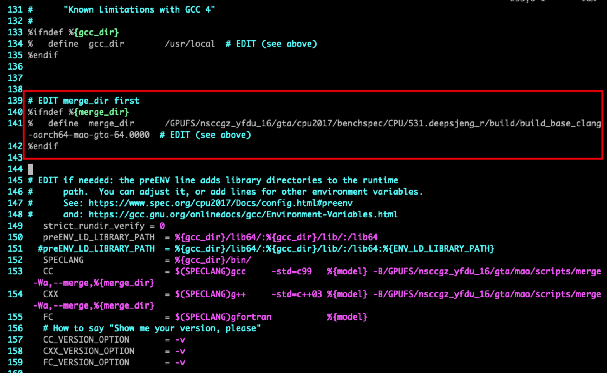
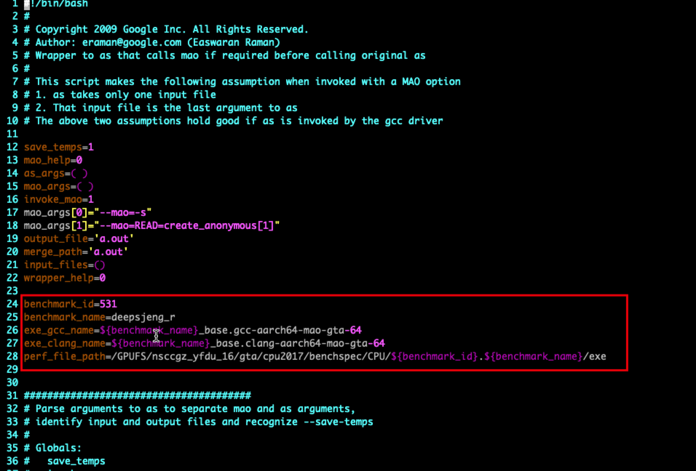
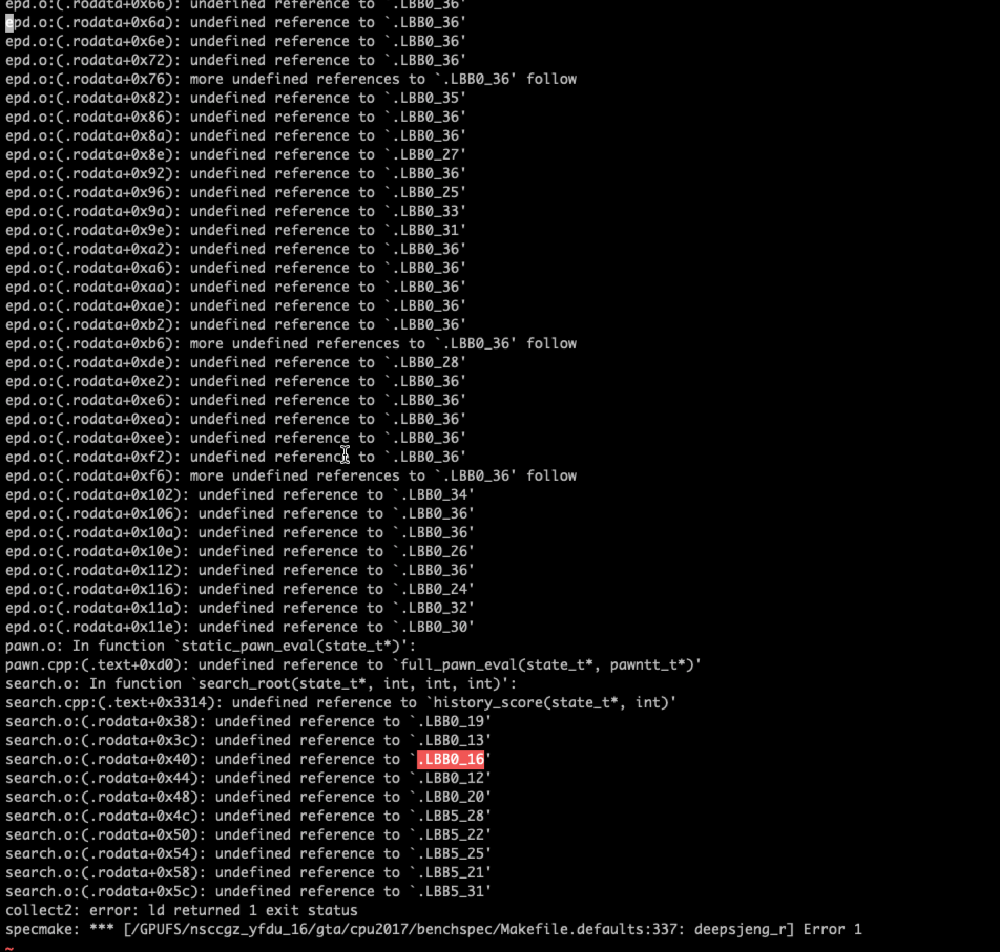

MAO - An Extensible Micro-Architectural Optimizer

This project seeks to build an infrastructure for micro-architectural
optimizations at the instruction level.  

MAO is a stand alone tool that works on the assembly level. MAO parses
the assembly file, perform all optimizations, and re-emit another
assembly file. After this, the assembler can be invoked to produce a
binary object. MAO reuses much of the code in the GNU Assembler (gas)
and needs binutils-2.19.1 to build correctly. 

The current MAO version is a an early prototype targeting x86, but
with big plans for the future.

See http://code.google.com/p/mao for more infomation.

MacOS
```
tar -jxvf binutils-2.19.1.tar.bz2
mkdir binutils-2.19.1-obj-x86_64-macos 
cd binutils-2.19.1-obj-x86_64-macos 
../binutils-2.19.1/configure --target=x86_64-macos --disable-nls  --disable-werror CFLAGS="-fbracket-depth=1024"
make OS=MacOS
cd ../src
make TARGET=i686-linux
make TARGET=x86_64-linux
```


Linux-x86_64 (using gcc-4.8.5 & binutils-2.35)
```
tar -xvf binutils-2.35.tar.gz
patch -p0<data/binutils-2.35-mao.patch
mkdir binutils-2.35-obj-x86_64-linux 
cd binutils-2.35-obj-x86_64-linux 
../binutils-2.35/configure --target=x86_64-linux 
make -j 4 
cd ../src-2.35
make -j 4  TARGET=x86_64-linux

ln -sf ../bin/mao-aarch64-none-linux ../scripts/mao 
ln -sf /usr/bin/as ../scripts/as-orig
```

Linux-aarch64 (using aarch64-linux-gnu-gcc 9.3.0)
```
# apt-get install gcc-arm-linux-gnueabi  #32bits
# apt-get install gcc-aarch64-linux-gnu  #64bits
# apt-get install qemu
# aarch64-linux-gnu-gcc -static /root/workspace/mao/benchmarks/src/hello.c -o hello # just for test
# file hello
# qemu-aarch64 hello

wget http://ftp.gnu.org/gnu/binutils/binutils-2.35.tar.gz
tar -xvf binutils-2.35.tar.gz
#the patch here doesn't update now
patch -p0<data/binutils-2.35-mao.patch
mkdir binutils-2.35-obj-aarch64-none-linux
cd binutils-2.35-obj-aarch64-none-linux
../binutils-2.35/configure --target=aarch64-none-linux
make -j 4 
cd ../src
make -j 4  TARGET=x86_64-linux

ln -s ../bin/mao-x86_64-linux ../scripts/mao 
ln -s /usr/bin/as ../scripts/as-orig
```


## 使用 mao 进行 function merge 

TL;DR

```
/GPUFS/nsccgz_yfdu_16/gta/cpu2017/bin/runcpu --config=mao/gcc-aarch64-mao --action build 531.deepsjeng_r --rebuild
/GPUFS/nsccgz_yfdu_16/gta/cpu2017/bin/runcpu --config=mao/clang-aarch64-mao --action build 531.deepsjeng_r --rebuild

sh ./generate_data.sh

vim /GPUFS/nsccgz_yfdu_16/gta/cpu2017/config/mao/gcc-clang-aarch64-mao.cfg
vim /GPUFS/nsccgz_yfdu_16/gta/mao/scripts/CUR/as

/GPUFS/nsccgz_yfdu_16/gta/cpu2017/bin/runcpu --config=mao/gcc-clang-aarch64-mao --action build 531.deepsjeng_r --rebuild

sh ./result_perf.sh
```

0. 确保 mao 已被正确编译， 建立链接。

   ```
   # 在/GPUFS/nsccgz_yfdu_16/gta/mao/src-2.35下
   
   make clean
   make -j4
   ln -s ../bin/mao-x86_64-linux ../scripts/mao 
   ln -s /usr/bin/as ../scripts/as-orig
   ```
   
1. 假设你要 merge '531.deepsjeng_r' 这个benchmark，首先你要分别用 gcc 和 clang 去编译它，会在 exe/ 下得到可执行文件，build/ 下得到汇编文件。

    这一步中对于不同 benchmark 不需要对 cfg 进行修改。

    ```
    # 在/GPUFS/nsccgz_yfdu_16/gta/cpu2017/config/mao下
    
    /GPUFS/nsccgz_yfdu_16/gta/cpu2017/bin/runcpu --config=mao/gcc-aarch64-mao --action build 531.deepsjeng_r --rebuild=
    /GPUFS/nsccgz_yfdu_16/gta/cpu2017/bin/runcpu --config=mao/clang-aarch64-mao --action build 531.deepsjeng_r --rebuild
    ```

2. 到 exe/ 目录下去 perf 两个可执行文件，得到 perf.data，解析 perf.data 得到 perf.txt。

   这个shell可以在` /GPUFS/nsccgz_yfdu_16/gta/cpu2017/benchspec/CPU/531.deepsjeng_r/exe/generate_data.sh `找到。

   ```
   # 在/GPUFS/nsccgz_yfdu_16/gta/cpu2017/benchspec/CPU/531.deepsjeng_r/exe下
   
   sh ./generate_data.sh
   ```

3. 利用第一步build/ 下得到汇编文件和第二步得到的 perf.txt 进行 merge。

    这一步中对于不同 benchmark **需要**对 cfg 进行修改。

    - 修改 gcc-clang-aarch64-mao.cfg 中的 merge_dir。由于CC用的gcc，这里需要指定为clang的build目录。

      

    - 修改as。指定了exe的路径，用于寻找 perf.data。

      

    ```
    # 在/GPUFS/nsccgz_yfdu_16/gta/cpu2017/config/下
    
    vim /GPUFS/nsccgz_yfdu_16/gta/cpu2017/config/mao/gcc-clang-aarch64-mao.cfg
    vim /GPUFS/nsccgz_yfdu_16/gta/mao/scripts/merge/as
    /GPUFS/nsccgz_yfdu_16/gta/cpu2017/bin/runcpu --config=mao/gcc-clang-aarch64-mao --action build 531.deepsjeng_r --rebuild
    ```

    大概率会出现找不到 label的错误，有的可以通过删掉这一段，然后手动编译来解决，例如：

    

    ```
    #在/GPUFS/nsccgz_yfdu_16/gta/cpu2017/benchspec/CPU/531.deepsjeng_r/build/build_peak_gcc-clang-aarch64-mao-gta-64.0000下
    
    /usr/local/bin/g++     -std=c++03 -mabi=lp64  -c -o epd.o -DSPEC -DNDEBUG -DSMALL_MEMORY -DSPEC_AUTO_SUPPRESS_OPENMP  -O0         -DSPEC_LP64 epd.o.mao.s.gcc_clang.s
    
    /usr/local/bin/g++     -std=c++03 -mabi=lp64  -c -o search.o -DSPEC -DNDEBUG -DSMALL_MEMORY -DSPEC_AUTO_SUPPRESS_OPENMP  -O0         -DSPEC_LP64 search.o.mao.s.gcc_clang.s
    
    
    /usr/local/bin/g++     -std=c++03 -mabi=lp64 -B/GPUFS/nsccgz_yfdu_16/gta/mao/scripts/merge -Wa,--merge,/GPUFS/nsccgz_yfdu_16/gta/cpu2017/benchspec/CPU/531.deepsjeng_r/build/build_base_clang-aarch64-mao-gta-64.0000      -O0          attacks.o bitboard.o bits.o board.o draw.o endgame.o epd.o generate.o initp.o make.o moves.o neval.o pawn.o preproc.o search.o see.o sjeng.o state.o ttable.o utils.o                      -o deepsjeng_r
    
    cp ./deepsjeng_r ../../exe
    ```

4. 对比 merge 得到的可执行文件的结果。

   这个shell可以在` /GPUFS/nsccgz_yfdu_16/gta/cpu2017/benchspec/CPU/531.deepsjeng_r/exe/result_perf.sh `找到。

   ```
   # 在/GPUFS/nsccgz_yfdu_16/gta/cpu2017/benchspec/CPU/531.deepsjeng_r/exe下
   
   sh ./result_perf.sh
   ```
